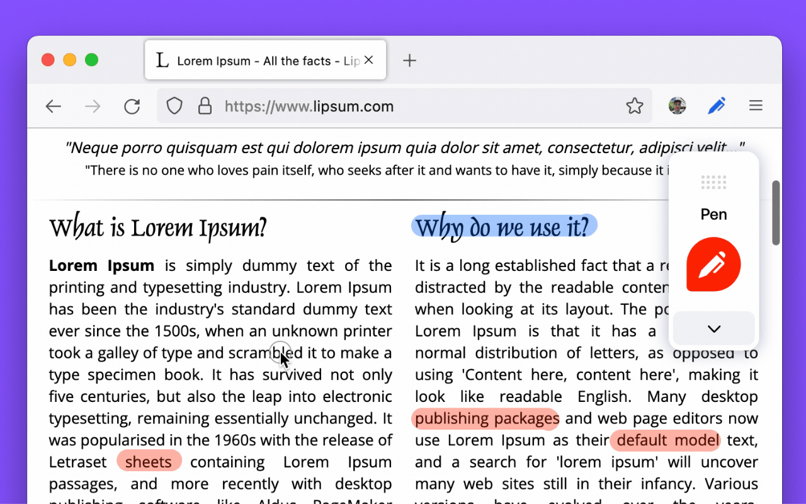
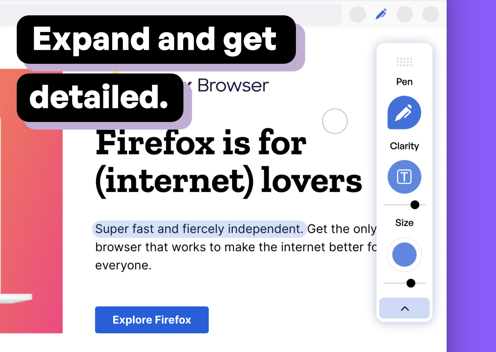

**Status:** Development (expect bug fixes and major updates)

 

# Marker

Draw is a Mozilla Firefox Browser Add-On that lets you draw on any Website.

Please first navigate to a website, then press on the toolbar button to activate the add-on. Once the interface appears on the page, please choose the desired mode. 

Currently, there are two modes available, Drawing Mode and Brushing Mode. Brushing mode is for drawing with mouse or pen (touch-enabled devices) on the page. You can choose a pencil, circle, or spray brush in this mode. 

There is also an option to change the color and width of the brushing tool from the UI. The other mode is for drawing 
shapes (Drawing Mode). When you select this mode, five different primitive shapes are available to choose from the UI. Once you click on a shape, it will be added to the screen.

You can drag and drop, remove, resize, or rotate and zoom objects on the screen. To print the page with your drawings on it, please press on the print button at the top left corner of the screen. 

Once you are done with the drawing, please close the interface by pressing on the close button at the top left corner or pressing on the toolbar button once. Before closing, you can save your drawings by pressing on the - Save - button at the bottom of the UI.

Note: this extension uses fabric.js (https://github.com/fabricjs/fabric.js) open-source JavaScript project for drawing on the HTML5 canvas element.

You can install this app as a PWA on your mobile device, moreover, it is available as a browser extension as-well-as a web application:

Firefox: https://addons.mozilla.org/en-US/firefox/addon/marker-ink/ 

Have a nice day! 😊
