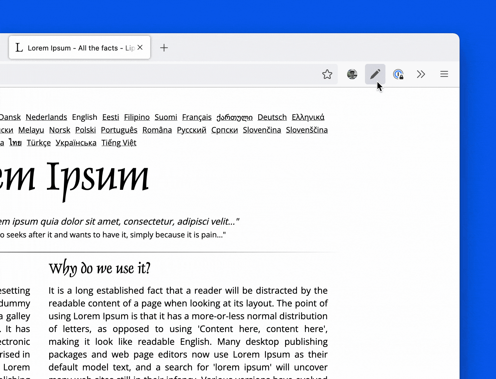

 
 

---

### Marker is a Browser Add-On that lets you draw on any Website.

Please first navigate to a website, then press on the toolbar button to activate the add-on. Once the interface appears on the page, please choose the desired mode. All drawings are Auto-Saved, revisit them anytime.

> **Status:** Development (expect bug fixes and major updates)

### Features

- Pen
- Eraser (With `Backspace`)
- Mouse (With `ESC`)
- Undo (With `⌘ Cmd` `Z`)
- Redo (With `⌘ Cmd` `Y`)
- Context Menu:
  - Copy (With `⌘ Cmd` `C`)
  - Paste (With `⌘ Cmd` `P`)
  - Save (Download as PNG)

### Roadmap

*Coming Soon - (No ETA)*:
- [ ] Additional Brushes
  You should be able to choose between Pen, Circle, or Spray Brush.
- [ ] Geometry
  You can drag and drop, remove, resize, or rotate and zoom objects on the screen. 

### Powered by

If you like this Extension, consider Donating or Contributing to these Projects:

- [fabric.js 5.2.0](https://github.com/fabricjs/fabric.js) 
Open-source JavaScript project for drawing on the HTML5 canvas element.

### Install

This Extension has been created for Mozilla Firefox. "A Browser for people not for profit."
To support an open Internet there is no intention to release this Add-On for Chrome/Opera/etc.

