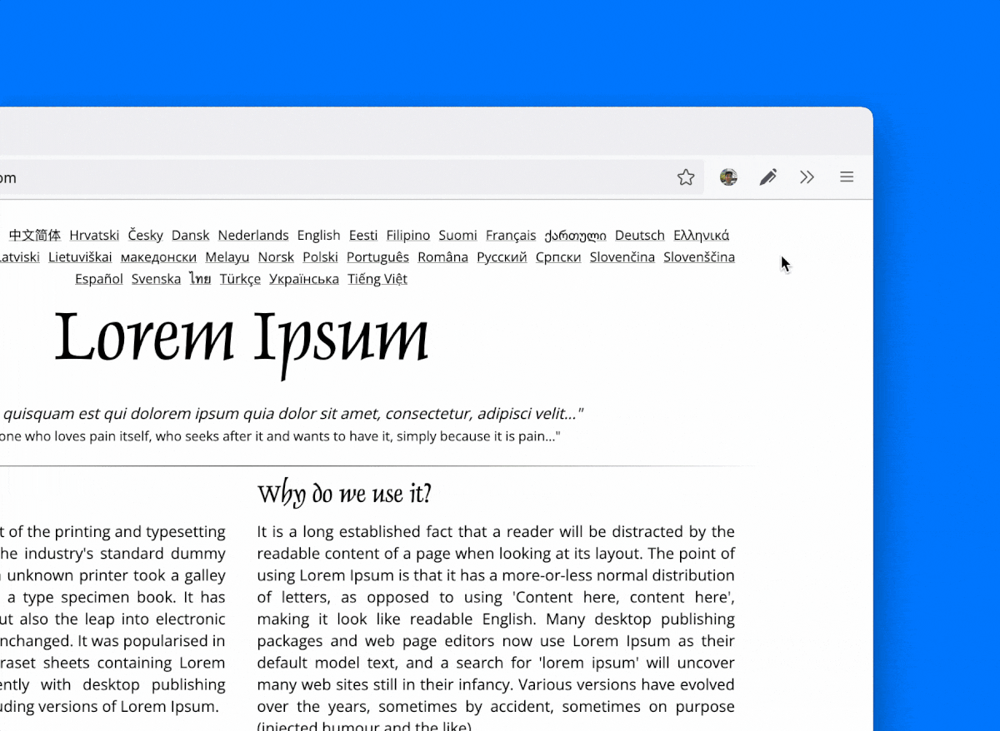

 
 

---

### Marker is a Mozilla Firefox Browser Add-On that lets you draw on any Website.

Please first navigate to a website, then press on the toolbar button to activate the add-on. Once the interface appears on the page, please choose the desired mode. 

### Available Modes

- Pen
  This mode is for drawing with Mouse or Pen (touch-enabled devices) on the Page.
- Eraser
- Mouse `Press ESC`
  This mode is to disable the Drawing and interact with the Page.

*Coming Soon - (No ETA)*:
- [ ] Additional Brushes
  You should be able to choose between Pen, Circle, or Spray Brush.
- [ ] Geometry
  You can drag and drop, remove, resize, or rotate and zoom objects on the screen. 

### Extras
To Download the Page with your drawings on it or Clear the Board, use the Right-Click.
And all drawings are Auto-Saved too!

### Note
this extension uses [fabric.js](https://github.com/fabricjs/fabric.js) 
Open-source JavaScript project for drawing on the HTML5 canvas element.

### Install
Firefox: https://addons.mozilla.org/en-US/firefox/addon/marker-ink/ 

> **Status:** Development (expect bug fixes and major updates)

Have a nice day! 😊
